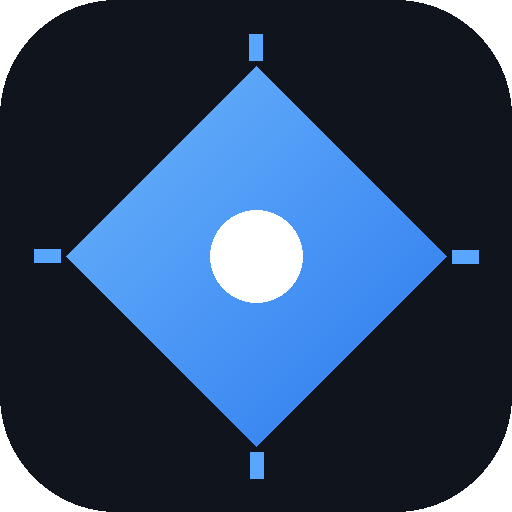
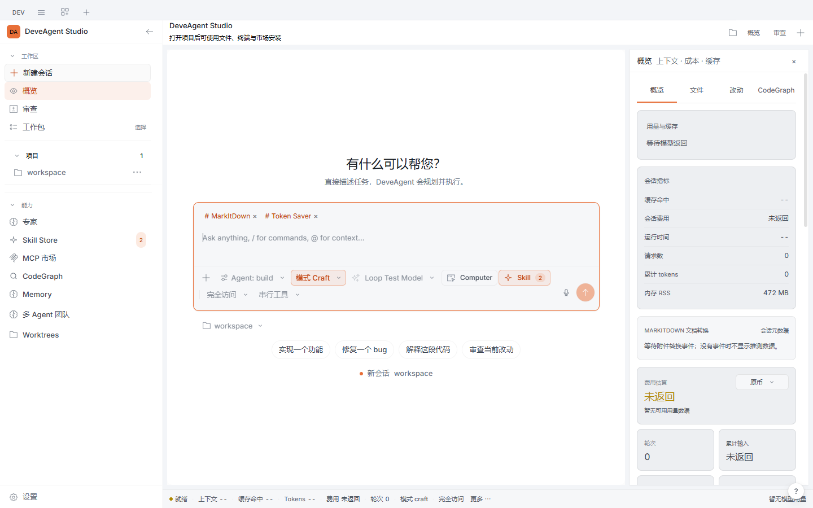
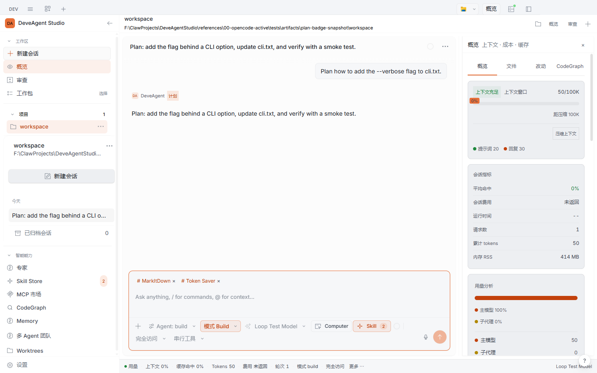
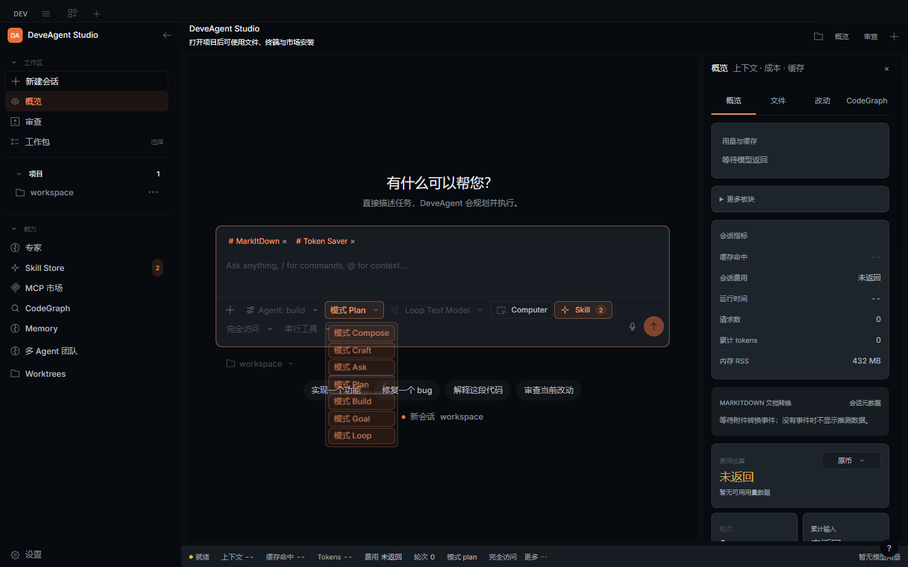
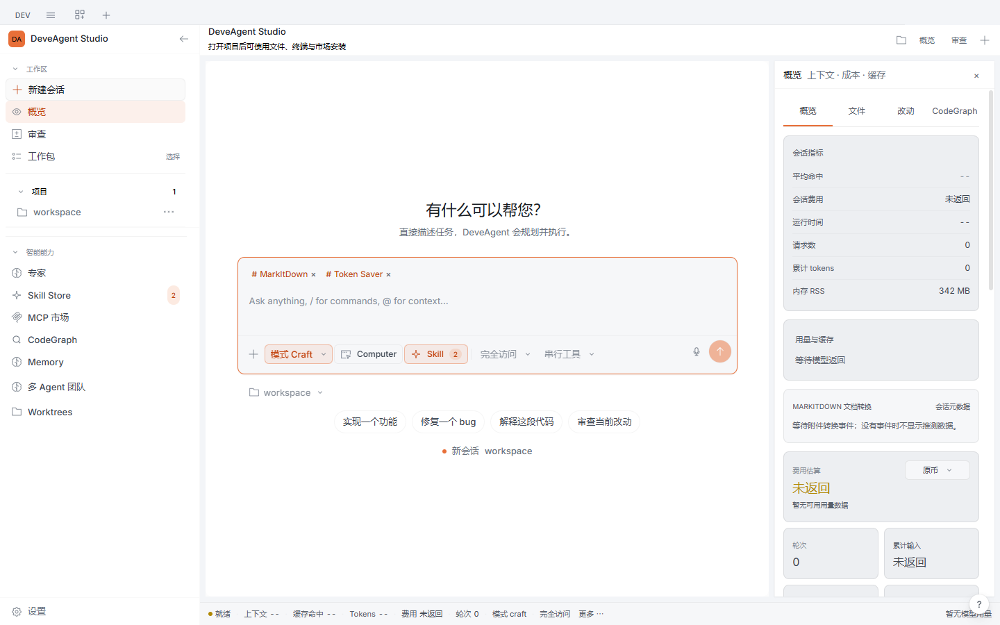

<div align="center">



# DeveAgent Studio

**An autonomous agent workstation for coding, planning, and long-running tasks.**

Built on the OpenCode architecture, with a DeveAgent-native shell — goals that
verify themselves, teams that cross-examine each other, and a UI that shows
what the agent is actually doing.

[](../../releases)
[](#install)
[](./LICENSE)
[](#languages)

**English** · [简体中文](./docs/readme/README.zh-CN.md) · [繁體中文](./docs/readme/README.zht.md) · [日本語](./docs/readme/README.ja.md) · [한국어](./docs/readme/README.ko.md) · [Deutsch](./docs/readme/README.de.md) · [Français](./docs/readme/README.fr.md) · [Español](./docs/readme/README.es.md) · [Русский](./docs/readme/README.ru.md) · [All 29 →](./docs/readme/README.md)

</div>

---

## Why this exists

Most AI coding tools are either a terminal with a chat box, or a pretty window
that hides what the model is doing. Neither survives a long task.

DeveAgent Studio started from a simple observation while building real projects
with coding agents: **the hard part is not the first answer, it is hour six.**
A run that cannot tell you what it changed, what it spent, why it stopped, or
whether it actually finished is a run you cannot trust with real work.

So this project keeps the OpenCode engine — proven tool calling, permissions,
sessions, Git and terminal integration — and builds an agent layer on top that
is *bounded*, *observable*, and *recoverable*.

## Screenshots

<table>
<tr>
<td width="50%">

**Session workbench** — conversation, live metrics, and the agent's plan in one
frame. A sub-agent strip inside the composer shows what is running right now
and how far the active goal's criteria have progressed; the status bar keeps
context usage, cache hits, tokens, cost and rounds in one calm glyph line.



</td>
<td width="50%">

**Plan mode with a snapshot badge** — planning output is visually distinct from execution output, and the badge follows the mode the turn actually ran in, not whatever the composer shows later.



</td>
</tr>
<tr>
<td width="50%">

**Composer controls** — mode, model, thinking level, permissions, skills and experts in one frame. Every popover is reachable by mouse and by keyboard, in light and dark, at narrow widths.



</td>
<td width="50%">

**Project sidebar** — projects, sessions, work packs and capabilities in one scrolling column. Archiving, restoring and removing a project all work without touching your files.



</td>
</tr>
</table>

## What makes it different

### Bounded autonomy, not a firehose

| Capability | What it actually does |
| --- | --- |
| **Goal** | Turn a request into an acceptance-criteria goal. The agent works, calls `goal-verify`, and an **independent verifier model** re-checks every criterion against the transcript before the goal may complete. Budget and deadline are enforced; a goal that cannot read its usage meter stops instead of spending blind. |
| **Go mode** | One switch: submit a goal and it is confirmed automatically, running plan → execute → self-verify without a confirmation round trip. |
| **Loop** | Repeat a task on an interval or cron with run budgets, retry limits, wall-clock deadlines and a lease so two workers never run the same pass. |
| **Team / MoA** | Dispatch parallel or debating members as real child sessions, each with its own model and role. Failed members can be retried individually. |
| **Grilling** | An adversarial mode that cross-examines a plan before you commit to it. |
| **Self-improvement** | The agent can persist a reusable procedure as a skill (`skill-save`), validated and written to `.deveagent/skills/`. A provenance ledger records who wrote each skill; the agent may only update its own — user-authored and pinned skills are refused, never silently overwritten. Unused skills go stale in the ledger after 30 days, archived after 90 — nothing is deleted. |

### Honest by construction

- **No silent paid fallback.** A provider fallback may only switch to a model
  whose cost is known to be zero. Paid candidates are skipped by default, and
  when a switch happens you get an in-app announcement — not just a log line.
- **No invented numbers.** Cache hit rate, cost, tokens and rounds come from
  provider usage records. When the provider returns nothing, the UI says
  "not returned" instead of showing `0`.
- **No fake progress.** A failed child turn fails the task. A swallowed error
  that let a run report success while its model was returning 500s was treated
  as a bug, traced to the wait seam, and fixed with a regression probe.

### Built for long runs

- **Checkpoints and rewind** — restore file bytes and conversation position to
  any earlier turn.
- **Durable memory** — decisions, bug history and task notes persist in the
  workspace and are retrieved on demand, not injected wholesale.
- **Cache-first prompt architecture** — a byte-stable system prefix and a
  turn-tail runtime state block, so switching modes mid-session keeps the
  cached prefix intact (measured: 100% of the prefix bytes unchanged across a
  mode switch).
- **Segmented startup timing** — script, workbench, composer and provider
  readiness are timed honestly and exposed for diagnosis.

## Install

Download the latest build from the [releases page](../../releases).

| Platform | Package |
| --- | --- |
| Windows | `DeveAgent-Studio-win-x64.exe` |
| macOS | `DeveAgent-Studio-mac-*.dmg` |
| Linux | `DeveAgent-Studio-linux-*.AppImage` |

Then open the app, connect a provider in **Settings → Providers** (any
OpenAI-compatible endpoint works, including free tiers), and start a session.

> **Bring your own key.** DeveAgent Studio does not ship credentials and does
> not proxy your requests. Your provider keys stay on your machine.

## Languages

The desktop UI ships 29 locales: English, 简体中文, 繁體中文, 日本語, 한국어,
Deutsch, Español, Français, Dansk, Norsk, Polski, Русский, Українська, العربية,
Português (Brasil), ไทย, Bosanski, Türkçe, Italiano, Nederlands, Svenska, Suomi,
Čeština, Magyar, Română, Ελληνικά, Tiếng Việt, Bahasa Indonesia, हिन्दी.

## Architecture

```
packages/
  desktop/   Electron shell, window, sidecar lifecycle, packaging
  app/       SolidJS UI — workbench, composer, timeline, dashboard
  opencode/  Agent runtime — sessions, tools, permissions, the DeveAgent plugin
  ui/        Design system (tokens, themes, components)
```

The DeveAgent layer lives in `packages/opencode/src/plugin/deveagent*.ts`
(goal/loop/team engines, memory, checkpoints, guardian, verifier) and
`packages/app/src/components/deveagent-*.tsx` (workbench surfaces). The
OpenCode engine underneath is kept intact — this project extends it, it does
not fork its behaviour.

## Development

```bash
bun install
bun run --cwd packages/app test:unit
bun run typecheck
node script/package-desktop.mjs <label>   # produces a packaged build
```

See [CONTRIBUTING.md](./CONTRIBUTING.md) for the full workflow.

## Status and honest boundaries

This is an active project, not a finished product. What is verified today:

- 535 app unit tests, 274 agent-runtime tests, 6 locale-parity gates — green.
- End-to-end acceptance probes run against **packaged builds**, not source:
  real-model smoke, plan mode, loop, background tasks, MoA debate, team retry,
  rewind checkpoints, MCP connect/failure states, composer geometry, startup
  timing, cache A/B.

What is **not** verified, and should not be claimed:

- No multi-hour real-workload soak test has been run. Recovery paths are tested
  with fixtures and free models, not with an eight-hour production session.
- Model quality is whatever provider you connect. This project makes runs
  observable and bounded; it does not make a model smarter.
- Computer Use covers window inventory, focus, UI element trees and input on
  Windows; desktop OCR and cross-application workflows are not claimed.

## License

MIT — see [LICENSE](./LICENSE).

Built on [OpenCode](https://github.com/anomalyco/opencode) (MIT).
